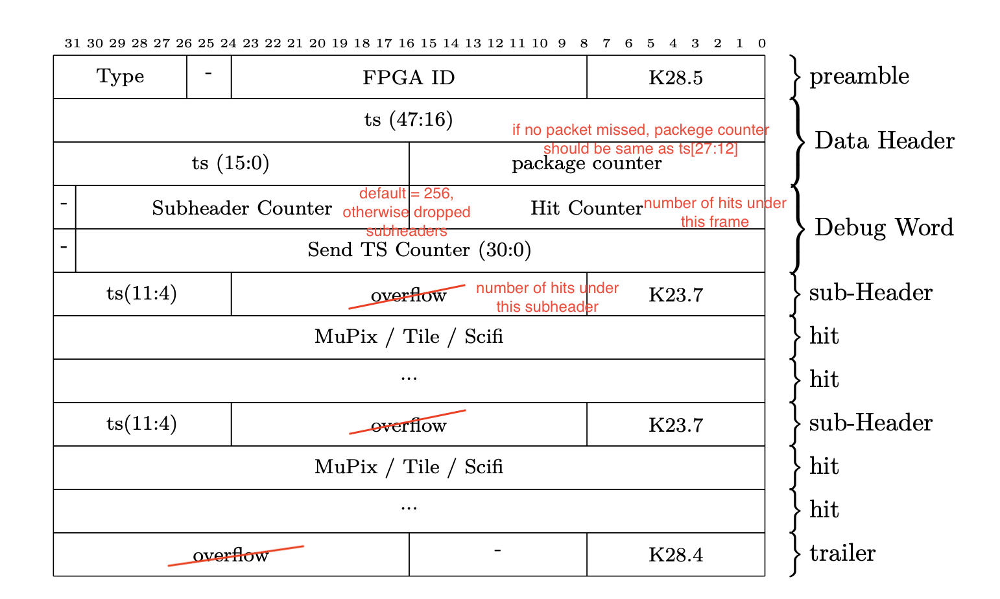

# **Description**

This IP is generates the Mu3e standard data frame given input of sub-frames.

# **Notes**

* It acts as the CDC stage for transferring from data path clock (125 MHz) to the tranceiver clock (156.25 MHz). 

* It pack upstream subframe packets (containing subheaders and hits if any) into Mu3e main frame. You may change `N_INTERLEAVING_FACTOR` to reflect the number of lanes of subframe from downstream (default = 4). It follows a non-working-conserving arbitration rule that grant the smallest subheader and assert blocking while lane emply. This arbitration rule guarantees the absolute sorting of subframes in mono-increasing subframe timestamp ([11:4]). 

* The output of this IP is the Mu3e Main Data Frame (packetized).

* [TODO] In case of overflow, the subframe packet has to be evicted and blocked for the rest of the framing time. This behavior can be realized by asserting `error` signal for store-and-forward mode FIFO. We have to ensure the FIFO is larger than some threshold to prevent "incast". 

* Input subframes are stored in `sub FIFO`. Write side is data path clock and read side is tranceiver clock. 

* The subframes are checked by the `frame delimit marker` and `lane scheduler` to decide for granting. 

* The subframes are stored and packed in the `main FIFO` (store-and-forward mode) to be read out to upstream by `Avalon Streaming Mutiplexer` with packet awareness, which can assert backpressure. An overflow will surpress or void the next frame to be generated or being generating. 

# **Data format**

Changes: 

* Since no overflow in the subheader is possible, this field has been reassigned to number of hits under this subheader. Otherwise, the upstream is safe to ignore this field. The last overflow has no meaning and is all zeros. 

* Package counter is a check for consistancy, for the upstream to sense overflow. 

